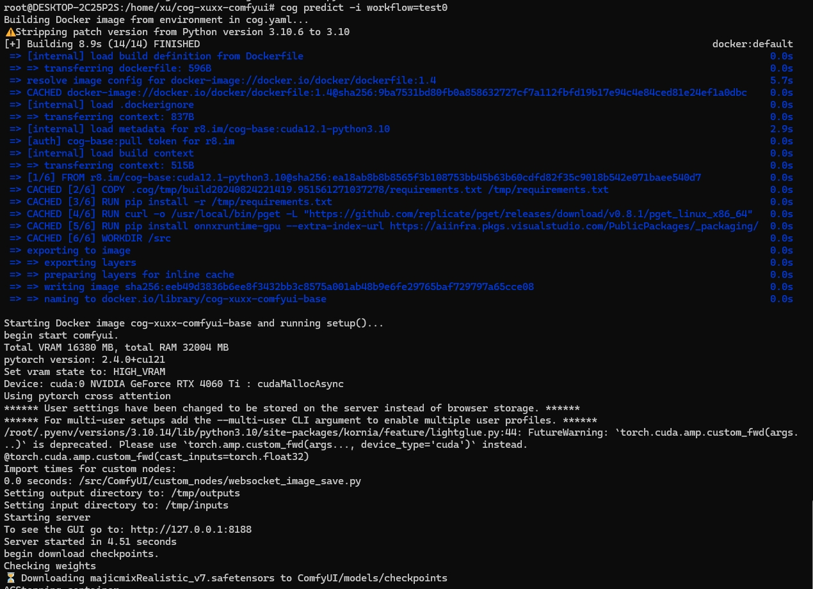
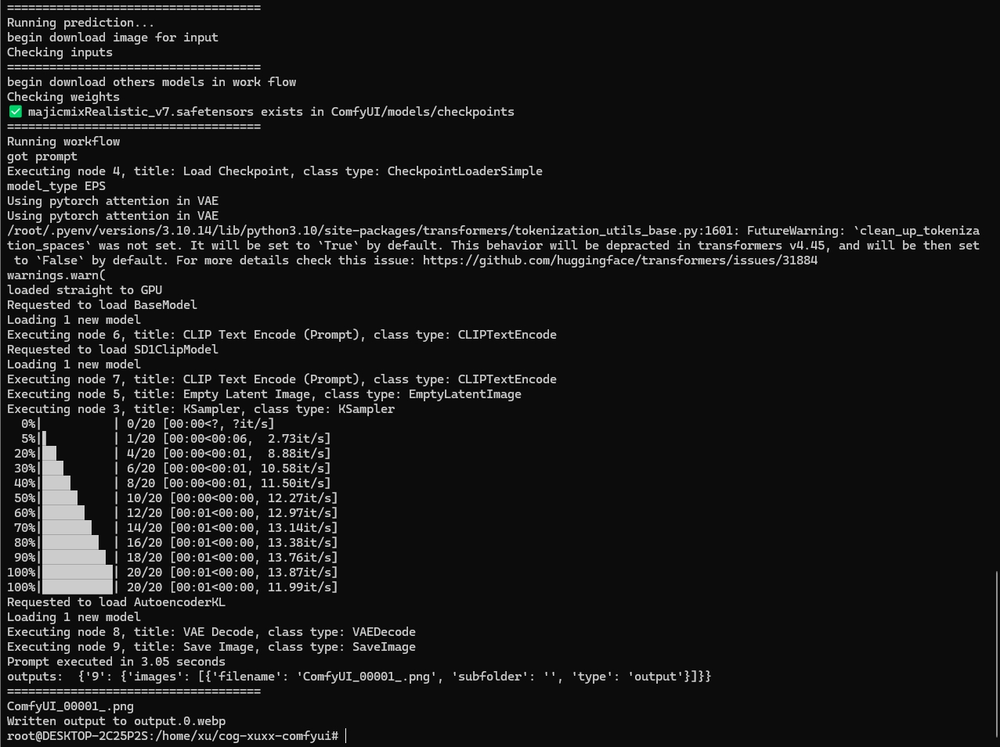

# Purpose

1. simply deploy comfyui, provide api.
2. publish to replicate, use replicate gpu.

# Pull Code

pull code in ubuntu
```
git clone https://github.com/xuhongming251/cog-xuxx-comfyui.git
```

```
cd cog-xuxx-comfyui
```

# Local UI Test

- start comfyui
```
sudo cog run -p 8188 bash
```

```
cd ComfyUI/
```
```
python main.py --listen 0.0.0.0
```

- open link
```
http://localhost:8188/
```
# Local API Test

```
python3 test_basic_api_example.py
```


# Local Predict Test

```
python3 test_local_predict_cmd.py
```

or use cmd below, it can print log real time

```
cog predict -i workflow=test0

```

```
cog predict -i workflow=test1
```

# Step by Step For Windows

1. [install wsl2](https://github.com/replicate/cog/blob/main/docs/wsl2/wsl2.md), see step 1-3
2. [install ubuntu24.04 in wsl2](https://github.com/replicate/cog/blob/main/docs/wsl2/wsl2.md), see step 4-5
3. [install docker](https://github.com/replicate/cog/blob/main/docs/wsl2/wsl2.md), see step 6
4. [install cog in ubuntu](https://github.com/replicate/cog/blob/main/docs/wsl2/wsl2.md), see step 7
5. test env in local

   1. Test the local UI by the link http://localhost:8188/ to verify that the env of comfyui and the custom nodes work.
   
   >> del all local checkpoints models、local input images, and test below.

   2. `python3 test_basic_api_example.py`, verify the dev workflow api json file.
   3. `python3 test_local_predict_cmd.py`, test local predict cmd.
   4. `cog predict -i workflow=test0`, the model file auto download by name.
   5. `cog predict -i workflow=test1`, input image use http online address.
   6. `cog predict -i workflow=test1`, that the output dir images will return.

6. add github action for push model.(see `.github\workflows\push.yml`)
   1. need config secret REPLICATE_API_TOKEN at github config use [replicate api token, see Step 2、3](https://replicate.com/docs/guides/push-a-model-using-github-actions).
   2. need config PAT_TOKEN to access pull submodule for github actions. [config setp by step](https://stackoverflow.com/questions/65077036/how-to-checkout-submodule-in-github-action)
   3. push action

7. add custom node and publish
   1. add custom_nodes pip deps in `cog.yaml`
   2. check the checkpoints name has been in `weights.json` and the config_weihts_use_in_work_flow in `predict.py`.
   3. can add extra params in `predict.py`(not needed), predict fun.
   4. config `.dockerignore` file, add not static files like models file(will dynamic download) to dockerignore. (for local publish, ignore it for git action publish)
   5. change the input workflow params when invoke, use http online address in workflow for image.

# Have Tested

1. simple text 2 image workflow.
2. add only one custom node, reactor node.

# Tested Log


